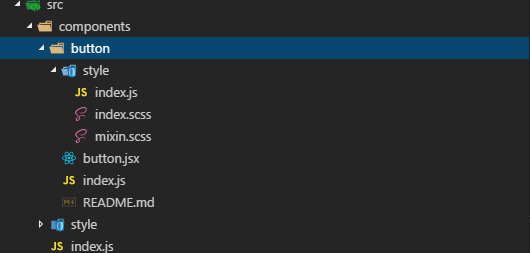
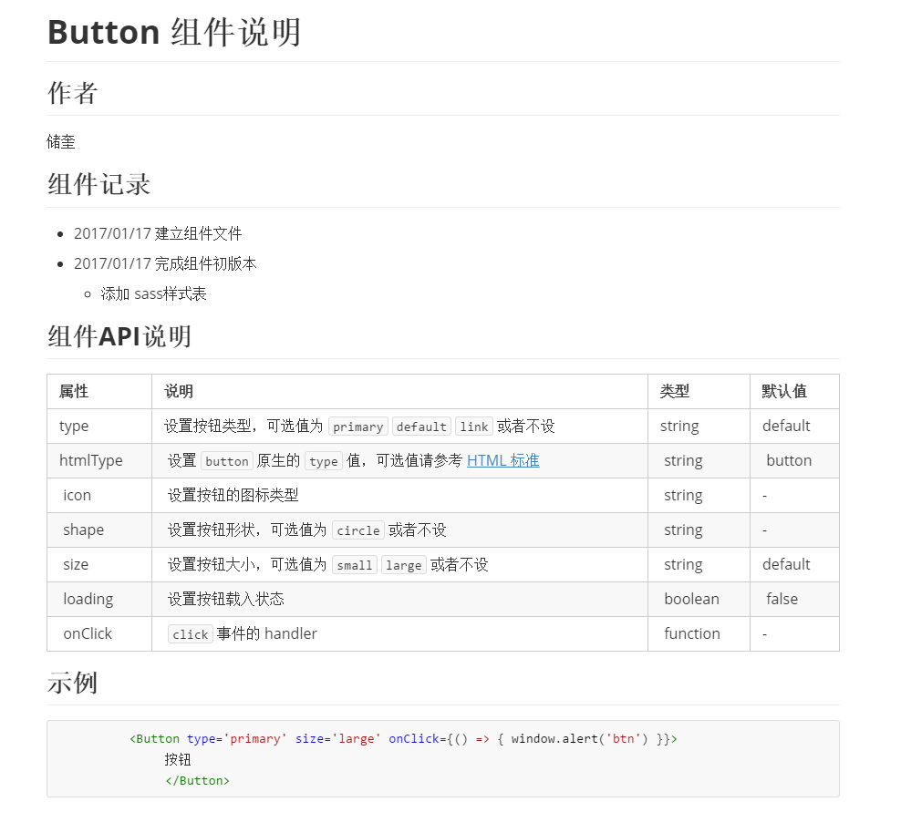

# METE DESIGN产品说明

## 技术规范

###  工具类

#### WebPack

[Webpack](https://github.com/webpack/webpack) 是当下最热门的前端资源模块化管理和打包工具。它可以将许多松散的模块按照依赖和规则打包成符合生产环境部署的前端资源。还可以将按需加载的模块进行代码分隔，等到实际需要的时候再异步加载。通过 `loader` 的转换，任何形式的资源都可以视作模块，比如 CommonJs 模块、 AMD 模块、 ES6 模块、CSS、图片、 JSON、Coffeescript、 LESS 等。

WebPack入门有一点门槛，建议初学者先看我们是如何配置的，然后再自己动手去了解相关的知识。这里我推荐两篇入门级别的文章，[Webpack-summary](https://diamont1001.github.io/webpack-summary/) 和 [入门Webpack，看这篇就够了](http://www.jianshu.com/p/42e11515c10f#)

#### JavaScript Standard Style

语法规范采用[JavaScript Standard Style](https://github.com/feross/standard) 工具来严格要求代码风格

在开发阶段不需要检测语法规范，但在build或者deploy阶段，在运行```npm run build```或者```npm run deploy```将会强行检测语法规范，当出现不符合规范时，standard脚手架将会在控制台打印输出相应的提示并且终止运行后面的编译工作。

> 如果想自动修复语法错误请运行```standard --fix```，但是像```debugger```这类调试语句将会忽略，需要手动去修复。如果想要了解更多关于standard rules，请点击[这里](http://standardjs.com/rules.html)

#### classNames

A simple javascript utility for conditionally joining classNames together.

在classNames插件中，我们可以轻松的管理业务逻辑比较复杂的css样式类，下面摘抄一句官方的话

> We take the stability and performance of this package seriously, because it is run millions of times a day in browsers all around the world. Updates are thoroughly reviewed for performance impacts before being released, and we have a comprehensive test suite.

想要了解更过关于className相关的资料，请点击[这里](https://github.com/JedWatson/classnames)

#### CSS Preprocessor · SASS

CSS 预处理器技术现在已经非常的成熟，CSS 预处理器是一种语言用来为 CSS 增加一些编程的的特性，无需考虑浏览器的兼容性问题，例如你可以在 CSS 中使用变量、简单的程序逻辑、函数等等在编程语言中的一些基本技巧，可以让你的 CSS 更见简洁，适应性更强，代码更直观等诸多好处。

> CSS allow you to do lots of things, but some features are missing to developers. What about variable, constants, and general faster syntax? As normal CSS can't do that, people created preprocessors to allow the use of variables on CSS files and then parse it to regular stylesheets.

常见的CSS预处理器有8种，分别是LESS CSS、SASS、Turbine、Switch CSS、CSS Cacheer、CSS Preprocessor、DT CSS、CSS PP。关于这8中预处理器的相关介绍可以点击[这里](http://www.catswhocode.com/blog/8-css-preprocessors-to-speed-up-development-time)， 这里我们采用SASS CSS预处理器。

关于SASS相关的语法，可以查看[阮一峰·SASS用法指南](http://www.ruanyifeng.com/blog/2012/06/sass.html)

#### Mixin

在诸如C++或者List着这样的传统语言中,织入模式就是一些提供能够被一个或者一组子类简单继承功能的类,意在重用其功能。

在Javascript中,我们会将从Mixin继承看作是通过扩展收集功能的一种途径.我们定义的每一个新的对象都有一个原型,从其中它可以继承更多的属性.原型可以从其他对象继承而来,但是更重要的是,能够为任意数量的对象定义属性.我们可以利用这一事实来促进功能重用。

Mixin支持在一个系统中降解功能的重复性,增加功能的重用性.在一些应用程序也许需要在所有的对象实体共享行为的地方,我们能够通过在一个Mixin中维护这个共享的功能,来很容易的避免任何重复,而因此专注于只实现我们系统中真正彼此不同的功能

在METE DESIGN产品中，你会看到我们在React组件和SASS中都有Mixin的身影。

关于Mixin的学习资料，请自行查阅，相信你会有很强的自学能力:-D。

### 组件书写要求

为了能够很好的维护组件，我们迫切需要一个统一的风格来约束开发人员，下面将会详细说明这一约束。

#### 文件目录

1. 每个组件都要求放到```src/components/```目录下。

2. 以组件名称命名，新建立一个文件夹。

3. 在组件文件夹下建立一个```index.js```文件，该文件作为组件暴露点。

4. 每个组件文件夹下都要求有一个style文件夹，来存放样式表文件，同样在该文件夹下要求建立一个index.scss文件作为暴露点。

5. 在组件文件夹下建立你要写的组件文件，比如```button```组件，我可以命名为```button.jsx```。

6. 在组件文件夹下要求建立一个```README.md```文件，内容主要记录组件的说明（作者、更新维护记录、API说明等等）。

   下面我给出一张文件结构示例图:

   

   下面提供一个`README.md`的示例

   
